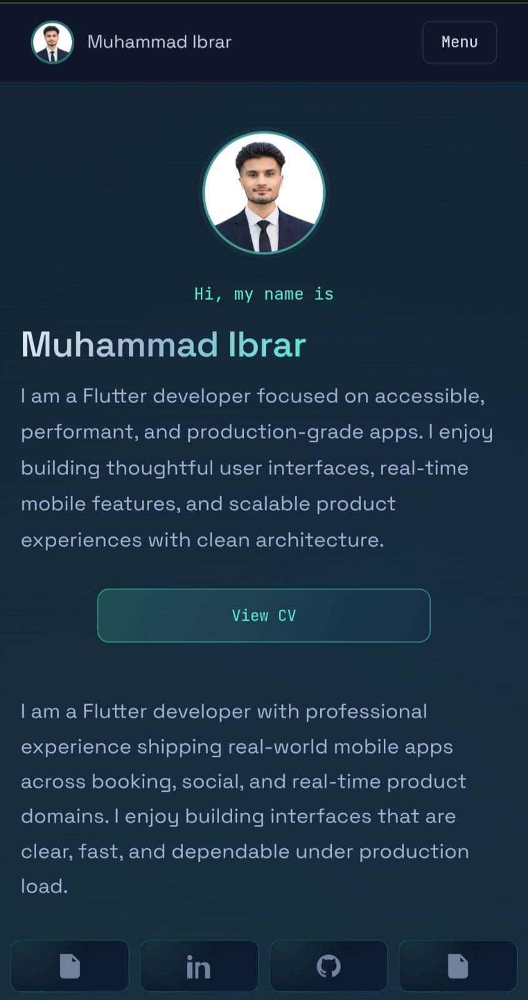
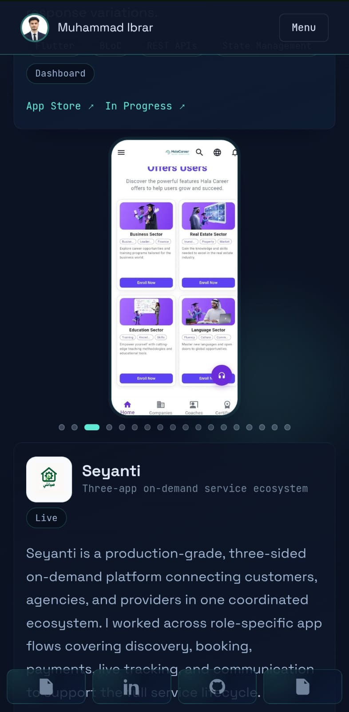
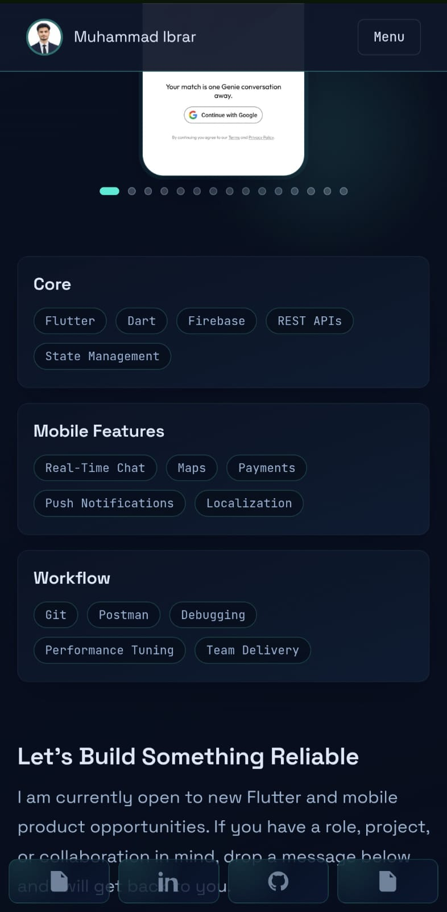
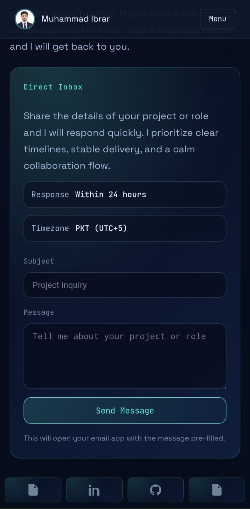

# Muhammad Ibrar Portfolio

A modern personal portfolio built with Next.js and React to showcase my profile, experience, selected projects, technical skills, and contact details. The site is designed as a fast, animated single-page experience with a left-side hero section and a content rail for the rest of the portfolio.

## Live Sections

- Hero intro and profile area
- About summary
- Experience timeline
- Projects showcase
- Skills overview
- Contact section
- Lightweight cursor and scroll effects

## Tech Stack

- Next.js 16
- React 19
- TypeScript
- Tailwind CSS 4
- Framer Motion

## Project Structure

- `app/` contains the Next.js App Router pages and global layout.
- `components/` contains all reusable portfolio sections and UI effects.
- `public/` contains static assets, including screenshots in `public/readme/`.

## Getting Started

### Prerequisites

- Node.js 18 or newer
- npm

### Install Dependencies

```bash
npm install
```

### Run the Development Server

```bash
npm run dev
```

Open `http://localhost:3000` in your browser.

### Build for Production

```bash
npm run build
```

### Start the Production Server

```bash
npm run start
```

## Screenshots

The screenshots below are stored in `public/readme/` and are included here for quick reference.

<table>
	<tr>
		<td align="center" width="25%"></td>
		<td align="center" width="25%"></td>
		<td align="center" width="25%"></td>
		<td align="center" width="25%"></td>
	</tr>
</table>

## Contact

If you want to get in touch or reuse this portfolio structure, update the contact section and deployment links with your own details.
